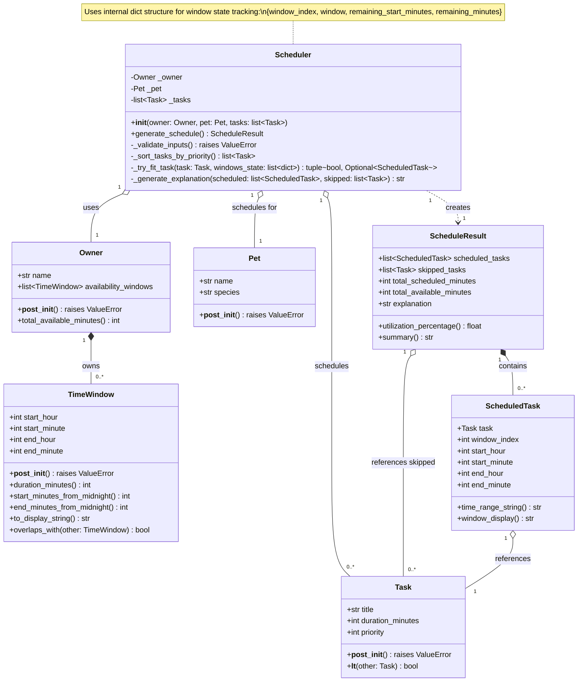

# PawPal+ Final UML Class Diagram

This is the refined UML diagram that accurately reflects the final implementation.

## Class Diagram

```mermaid
classDiagram
    Owner "1" *-- "0..*" TimeWindow : owns
    Scheduler "1" o-- "1" Owner : uses
    Scheduler "1" o-- "1" Pet : schedules for
    Scheduler "1" o-- "0..*" Task : schedules
    Scheduler "1" ..> "1" ScheduleResult : creates
    ScheduleResult "1" *-- "0..*" ScheduledTask : contains
    ScheduleResult "1" o-- "0..*" Task : references skipped
    ScheduledTask "1" o-- "1" Task : references

    class TimeWindow{
        +int start_hour
        +int start_minute
        +int end_hour
        +int end_minute
        +__post_init__() raises ValueError
        +duration_minutes() int
        +start_minutes_from_midnight() int
        +end_minutes_from_midnight() int
        +to_display_string() str
        +overlaps_with(other: TimeWindow) bool
    }

    class Task{
        +str title
        +int duration_minutes
        +int priority
        +__post_init__() raises ValueError
        +__lt__(other: Task) bool
    }

    class Pet{
        +str name
        +str species
        +__post_init__() raises ValueError
    }

    class Owner{
        +str name
        +list~TimeWindow~ availability_windows
        +__post_init__() raises ValueError
        +total_available_minutes() int
    }

    class ScheduledTask{
        +Task task
        +int window_index
        +int start_hour
        +int start_minute
        +int end_hour
        +int end_minute
        +time_range_string() str
        +window_display() str
    }

    class ScheduleResult{
        +list~ScheduledTask~ scheduled_tasks
        +list~Task~ skipped_tasks
        +int total_scheduled_minutes
        +int total_available_minutes
        +str explanation
        +utilization_percentage() float
        +summary() str
    }

    class Scheduler{
        -Owner _owner
        -Pet _pet
        -list~Task~ _tasks
        +__init__(owner: Owner, pet: Pet, tasks: list~Task~)
        +generate_schedule() ScheduleResult
        -_validate_inputs() raises ValueError
        -_sort_tasks_by_priority() list~Task~
        -_try_fit_task(task: Task, windows_state: list~dict~) tuple~bool, Optional~ScheduledTask~~
        -_generate_explanation(scheduled: list~ScheduledTask~, skipped: list~Task~) str
    }

    note for Scheduler "Uses internal dict structure for window state tracking:\n{window_index, window, remaining_start_minutes, remaining_minutes}"
```
